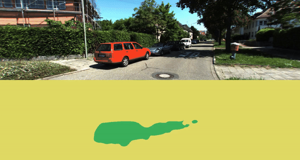

# Semantic Segmentation : Point Cloud Painting with Semantic Labels

The objective of this project is to apply semantic segmentation to point clouds collected from Lidar sensors. By doing so, each point in the cloud will be labeled with a category it belongs to (e.g., road, vehicle, pedestrian), effectively "painting" the 3D space with semantic information.

## Dataset 
The KITTI-360 dataset provides 360-degree views captured from a vehicle navigating through urban environments. It includes semantic labels for a variety of categories, making it an ideal dataset for training and evaluating semantic segmentation models on point clouds.  
Lidar pointclouds from velodyne sensor and RGB images is used for this project. 

## Model 

deeplabv3_resnet50 from PyTorch

## Method 

A detailed description and method is explained [here](https://rbe549.github.io/fall2022/hw/hw2/)

## How to Run

* Add necessary paths and calibration data path to the config file.
```
File Hierarchy
semantic_mapping/
├── calibration/
│   ├── calib.txt
│   ├── calib_cam_to_pose.txt
│   ├── calib_cam_to_velo.txt
│   ├── calib_sick_to_velo.txt
│   ├── perspective.txt
│   ├── image_02.yaml
│   └── image_03.yaml
├── config/
│   └── config.json
├── README.md
├── requirements.txt
└── wrapper.py
```

```
python3 wrapper.py --config config/config.json
```

## Results 

### 1. Semantically painted pointclouds


### 2. Semantically segmented



## Acknowledgement 

The project is done towards the completetion of course [RBE549](https://rbe549.github.io/fall2022/hw/hw2/)

## References

[1] [RBE549-HW2](https://rbe549.github.io/fall2022/hw/hw2/)    
[2] [PointPainting: Sequential Fusion for 3D Object Detection](https://arxiv.org/abs/1911.10150)

